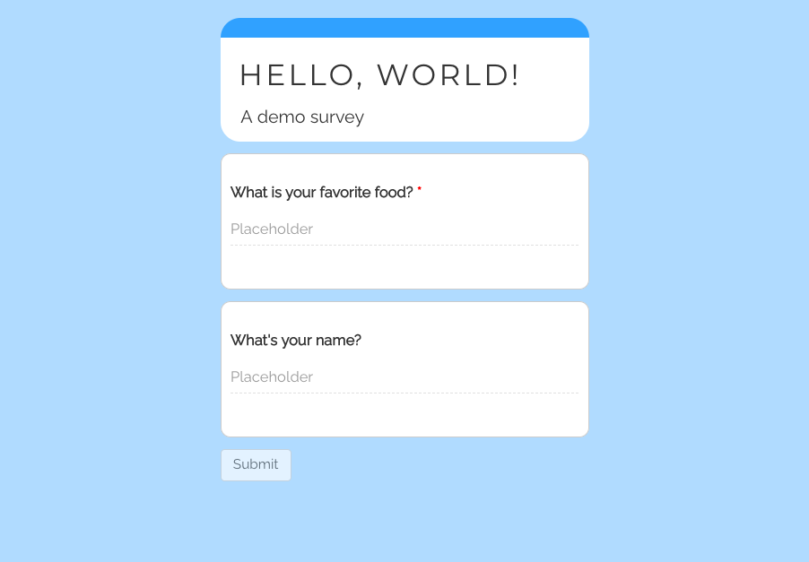
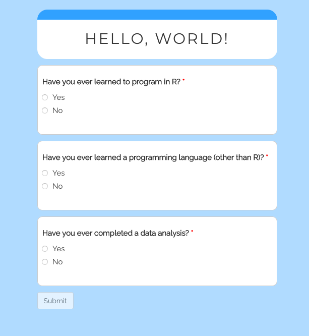

```{r, include = FALSE}
knitr::opts_chunk$set(
  collapse = TRUE,
  comment = "#>"
)
```

```{r setup, include = FALSE}
library(shinysurveys)
```

# Introduction

shinysurveys was developed, in large part, to automate data collection and analysis. In this vignette, I demonstrate the use of `getSurveyData()` to easily aggregate survey responses and help you, the designer, more quickly gain insights of the results. The output always follows the same structure, inspired by tidy data, where each row is an observation (question) and each column is a variable.

The 'subject_id' column can be used for identifying respondents. By default, it utilizes shinysurveys [URL-based user tracking feature](https://shinysurveys.jdtrat.com/articles/surveying-shinysurveys.html#user-tracking).[^1] The 'question_id' and 'question_type' columns correspond to 'input_id' and 'input_type' from the original data frame of questions. The 'response' column is the participant's answer.

[^1]: Alternative IDs can be supplied with the `custom_id` argument, however. For example, `getSurveyData(custom_id = input$name)` would save 'subject_id' as a participant's name -- "JT" in this case.

# Basic Example

As an example, consider the following shiny survey, containing questions about your favorite food and your name.

A "Submit" button is built into any shiny survey, but -- by default -- no actions are defined. So, when a user completes the survey, the app designer can specify what happens upon submission. In this case, I'll simply print a user's responses.[^2] The code for this is below:

[^2]: In practice, printing is not the end-goal. I use it here solely to demonstrate how easy it is to access response data.

```{r full-simple-app, eval = FALSE}

# Load packages
library(shiny)
library(shinysurveys)

# Define questions in the format of a shinysurvey
survey_questions <- data.frame(
  question = c("What is your favorite food?",
               "What's your name?"),
  option = NA,
  input_type = "text",
  input_id = c("favorite_food", "name"),
  dependence = NA,
  dependence_value = NA,
  required = c(TRUE, FALSE)
)

# Define shiny UI
ui <- fluidPage(
  surveyOutput(survey_questions,
               survey_title = "Hello, World!",
               survey_description = "A demo survey")
)

# Define shiny server
server <- function(input, output, session) {
  renderSurvey()
  
  observeEvent(input$submit, {
    response_data <- getSurveyData()
    print(response_data)
  })
  
}

# Run the shiny application
shinyApp(ui, server)
```

In the browser, the survey looks like this:



When I answer the survey and click submit, the following data frame is printed to the console, following the format described in the introduction.

| subject_id |  question_id  | question_type | response |
|:----------:|:-------------:|:-------------:|:--------:|
| NO_USER_ID | favorite_food |     text      |  Sushi   |
| NO_USER_ID |     name      |     text      |    JT    |

# Complex Example

In order to generalize `getSurveyData()`, it has to account for input types that may return multiple values. For example, shiny's `checkboxGroupInput` returns a character vector whose values correspond to the checked boxes. In order to ensure that this, and other custom input extensions,[^3] work with `getSurveyData()`, I collapse responses into a single character vector separated by commas. Consider the following application:

[^3]: If you are unfamiliar with custom input types, please see [my blog post](https://www.jdtrat.com/blog/extending-shinysurveys/) introducing them or the [documentation](https://shinysurveys.jdtrat.com/articles/custom-input-extensions.html).

```{r complex-example, eval = FALSE}
# Load packages
library(shiny)
library(shinysurveys)

# Register a "check" input type
extendInputType("check", {
  shiny::checkboxGroupInput(
    inputId = surveyID(),
    label = surveyLabel(),
    choices = surveyOptions(), 
  )
})

# Define question in the format of a shinysurvey
ice_cream_question <- data.frame(
  question = "Please indicate which of the following are your top three favorite ice cream flavors.",
  option = c("Chocolate", "Vanilla", "Strawberry", 
             "Mint Chocolate Chip", "Rocky Road", "Cookie Batter",
             "Hazelnut", "Cookies N' Cream", "Pistachio"),
  input_type = "check",
  input_id = "favorite_ice_cream",
  dependence = NA,
  dependence_value = NA,
  required = TRUE
)

# Define shiny UI
ui <- fluidPage(
  surveyOutput(ice_cream_question,
               survey_title = "Hello, World!")
)

# Define shiny server
server <- function(input, output, session) {
  renderSurvey()
  
  observeEvent(input$submit, {
    response_data <- getSurveyData()
    print(response_data)
  })
  
}

# Run the shiny application
shinyApp(ui, server)

```

When I answer the survey and click submit, the following data frame is printed to the console.

| subject_id |    question_id     | question_type |                response                 |
|:----------:|:------------------:|:-------------:|:---------------------------------------:|
| NO_USER_ID | favorite_ice_cream |     check     | Chocolate, Rocky Road, Cookies N' Cream |

# Dependency Example

`getSurveyData()` only aggregates data from questions that participants have actually seen. As mentioned in the introduction, this function returns one row per question. This is true by default, however, there are some features specific for dealing with dependency questions.

Consider the question set built into the package from a recent study by the [D'Agostino McGowan Data Science Lab](https://dmds.lucymcgowan.com/). There are `r length(unique(teaching_r_questions$input_id))` unique questions, but some will only be asked if a specific answer is provided.

For example, people who answer "Yes" to the question "Have you ever learned to program in R?" will be shown a numeric input question asking how many years they have been using R. If no, the next question -- about a programming language other than R -- will (continue) to be shown.

Consider the following survey, showing a subset of the built-in questions:



It can be created with the following code:

```{r dependency-survey, eval = FALSE}

# Load packages
library(shiny)
library(shinysurveys)

# Define questions in the format of a shinysurvey
dep_questions <- tail(teaching_r_questions, 12)

# Define shiny UI
ui <- fluidPage(
  surveyOutput(dep_questions,
               survey_title = "Hello, World!")
)

# Define shiny server
server <- function(input, output, session) {
  renderSurvey()
  
  observeEvent(input$submit, {
    response_data <- getSurveyData()
    print(response_data)
  })
  
}

# Run the shiny application
shinyApp(ui, server)
```

When I answer "No" to all questions and click submit, the following data frame is printed to the console:

| subject_id |          question_id           | question_type |    response     |
|:----------:|:------------------------------:|:-------------:|:---------------:|
| NO_USER_ID |           learned_r            |      y/n      |       No        |
| NO_USER_ID |         years_using_r          |    numeric    | HIDDEN-QUESTION |
| NO_USER_ID |   learned_programming_not_r    |      y/n      |       No        |
| NO_USER_ID |    years_programming_not_r     |     text      | HIDDEN-QUESTION |
| NO_USER_ID |    completed_data_analysis     |      y/n      |       No        |
| NO_USER_ID | number_completed_data_analysis |      mc       | HIDDEN-QUESTION |

This is notable for a few reasons. Firstly, I never saw the questions asking about how long I used R, how long I used another programming language, or how many data analyses I completed. The default behavior is to include all dependency questions and imputing "HIDDEN-QUESTION" for the response value. This will keep the data structure the same for all respondents, controlling for variability in participant responses. The imputed value can be changed with the `dependency_string` argument, e.g. `getSurveyData(dependency_string = "NOT-SEEN")`.

Dependency questions can also be excluded from the output as follows: `getSurveyData(include_dependencies = FALSE)`. This may result in the output having different number of rows depending on which questions a person answers. For example, if I answered no to all questions and have `include_dependencies = FALSE)`, my data would be:

| subject_id |        question_id        | question_type | response |
|:----------:|:-------------------------:|:-------------:|:--------:|
| NO_USER_ID |         learned_r         |      y/n      |    No    |
| NO_USER_ID | learned_programming_not_r |      y/n      |    No    |
| NO_USER_ID |  completed_data_analysis  |      y/n      |    No    |

In contrast, if I answered "Yes" to the first question, then my data would look like this:[^4]

[^4]: The response for years_using_r is NA because I did not answer it.

| subject_id |        question_id        | question_type | response |
|:----------:|:-------------------------:|:-------------:|:--------:|
| NO_USER_ID |         learned_r         |      y/n      |    No    |
| NO_USER_ID |       years_using_r       |    numeric    |    NA    |
| NO_USER_ID | learned_programming_not_r |      y/n      |    No    |
| NO_USER_ID |  completed_data_analysis  |      y/n      |    No    |

# Conclusion

In this vignette, I highlighted the use of `getSurveyData()` to easily aggregate survey responses. I hope you find this feature as useful as I have! It is especially powerful when implementing data collection and analysis pipelines. As a necessary disclaimer, *please test this on your survey before using it in a deployed application*. Although I have tested `getSurveyData()` in a variety of situations, I have not exhausted all custom input types and you may run into errors. If that happens, please file a [GitHub Issue](https://github.com/jdtrat/shinysurveys/issues) with a minimal app to reproduce the bug.

Thanks for reading, and happy surveying!
