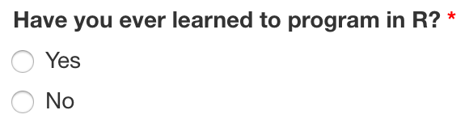

```{r, include = FALSE}
knitr::opts_chunk$set(
  collapse = TRUE,
  comment = "#>"
)
library(tibble)
```

```{r setup}
library(shinysurveys)
```

# Introduction

The ability to easily collect and analyze survey data is incredibly important. Many platforms provide user-friendly methods to do this. [Google Forms](https://www.google.com/forms/about/), [SurveyMonkey](https://www.surveymonkey.com/), and [Qualtrics](https://www.qualtrics.com/core-xm/survey-software/) are all popular options. However, these services don't always integrate easily with existing data analysis and/or research pipelines. Because of R's prevalence in academia and research, {shinysurveys} was developed to streamline the data collection and analysis process. 

In this vignette, I provide an overview of the main features of shinysurveys.[^shinysurveys-1] Aligned with the basic structure of {shiny} applications, consisting of the user-interface and server components, this package has a function for each: `surveyOutput()` and `renderSurvey()`, respectively. The former accepts a data frame of questions that follow a specific format. To illustrate this, I will show a questionnaire from a recent study conducted by the [D'Agostino McGowan Data Science Lab](https://dmds.lucymcgowan.com/) that is built into the `shinysurveys` package.[^shinysurveys-3] The first ten (of 54) rows of this data frame look like:

[^shinysurveys-1]: I assume familiarity with the basic layout of a Shiny application, as briefly outlined above. For additional information, please check out RStudio's [great resources](https://shiny.rstudio.com/tutorial/).

[^shinysurveys-3]: In the following code, I use the prefix `shinysurveys::` whenever I'm using a function specific to this package. If you are unfamiliar with this notation, see [[@rpkgs]](https://r-pkgs.org/namespace.html)

```{r, echo = FALSE}
shinysurveys::teaching_r_questions[1:10,]
```

This data can be described as a tidy data frame, where each row is a unique observation and each column is a variable. While the full table consists of 54 rows, there are only 11 unique questions:

```{r display unique questions, echo = FALSE}
unique(shinysurveys::teaching_r_questions$question)
```

The reason for the discrepancy between the number of rows and unique questions derives from the fact that certain questions can have more than one possible response. For example, the multiple choice question asking about gender has four options: "Female", "Male", "Prefer not to say", or "Prefer to self describe." It thus has four rows, one per each option.

To create a question in the required format, seven parameters must be supplied. They are described in the package documentation and can be accessed by typing `?shinysurveys::teaching_r_questions` in the R console:

-   *question*: The question to be asked.
-   *option*: A possible response to the question. In multiple choice questions, for example, this would be the possible answers. For questions without discrete answers, such as a numeric input, this would be the default option shown on the input. For text inputs, it is the placeholder value.
-   *input_type*: What type of response is expected? Currently supported types include `numeric`, `mc` for multiple choice, `text`, `select`,and `y/n` for yes/no questions.
-   *input_id*: The input id for Shiny inputs.
-   *dependence*: Does this question (row) depend on another? That is, should it only appear if a different question has a specific value? This column contains the input_id of whatever question this one depends upon.
-   *dependence_value*: This column contains the specific value that the dependence question must take for this question (row) to be shown.
-   *required*: logical TRUE/FALSE signifying if a question is required.

The next section describes input types native to {shinysurveys}.

## Examples

Below are examples of the currently supported question types. I provide a thorough explanation for the numeric input, but only point out notable differences for other inputs.

### Numeric Input

A good example of a numeric input is the first question: "What's your age?":

```{r what is your age preview, echo = FALSE}
subset(teaching_r_questions, input_id == "age")
```

As seen above, this row corresponds to the question "What's your age?". I know to expect a numeric response by looking at the `input_type` column, and the default value is equal to 25 according to the `option` column.[^shinysurveys-4]

[^shinysurveys-4]: It is important to note that the option column for numeric inputs provides the default value, but for other types -- as I will show -- it provides the possible options for a question.

I can also tell that there are no dependency questions. This means that no matter what value is entered, no follow-up question will appear. Lastly, I know it is a required question.[^shinysurveys-5]

[^shinysurveys-5]: Required question functionality will be discussed in more detail in the section [Required Questions](#required_questions).

{style="display: block; margin: 1em auto" width="300"}

### Multiple Choice (mc) Input {#multiple_choice}

An example of this is the question "Which best describes your gender?":

```{r what is your gender mc, echo = FALSE}
subset(teaching_r_questions, input_id == "gender" | input_id == "self_describe_gender")
```

Unlike numeric inputs, the `option` column represents each of the possible responses for this question. You may notice that the fifth row of this question has *NA* in the `option` column and "text" in the `input_type` column. I will discuss this in more detail [below](#dependency-questions), but for now, note that this question has a dependent. That is, if a specific option is chosen for this question, a new one will appear below. In this case, a question that accepts text as its input.

{style="display: block; margin: 1em auto" width="300"}

### Text Input {#text_input}

Questions that need text-based input should specify "text" in the `input_type` column. As noted in the previous example, the following is a dependent of the question "Which best describes your gender?":

```{r what is your gender text, echo = FALSE}
subset(teaching_r_questions, input_id == "self_describe_gender") 
```

As previously mentioned, the `option` column for text-based inputs corresponds to a placeholder value. It can be left blank (i.e. NA) or contain a character string. If they are left empty, the text field will display "Placeholder" as seen below. Otherwise, the character string will be displayed.

{.center style="display: block; margin: 1em auto" width="300"}

{.center data-latex="" style="display: block; margin: 1em auto" width="290" height="71"}

### Select Input

Select inputs are great when there are many potential, discretely defined, response choices.[^shinysurveys-6] An example is the question "What was your first language?" which contains `r nrow(subset(teaching_r_questions, question == "What was your first language?"))` options:

[^shinysurveys-6]: As of May 2021, these do not support multiple options selected at once, though I anticipate adding this functionality in the future.

```{r show first language options, echo = FALSE}
subset(teaching_r_questions, question == "What was your first language?")
```

{style="display: block; margin: 1em auto" width="300"}

### Yes or No (y/n) Input

Yes or no questions are self-explanatory. An example is the question "Have you ever learned to program in R?":

```{r learned to program in R, echo = FALSE}
subset(teaching_r_questions, input_id == "learned_r")
```

{style="display: block; margin: 1em auto" width="300"}

With an understanding of the available input types, I will now discuss how to implement a survey using this package.

### Matrix Input

Survey questions are often presented in a grid. Consider the question:

*Please indicate whether you agree, disagree, or are neutral about the following items. (1) I love sushi. (2) I love chocolate.*

```{r setup-matrix-question, echo = FALSE}

matrix_question <- data.frame(
   question = c(rep("I love sushi.", 3), rep("I love chocolate.",3)),
   option = c(rep(c("Disagree", "Neutral", "Agree"), 2)),
   input_type = rep("matrix", 6),
   input_id = rep("matId", 6),
   dependence = NA,
   dependence_value = NA,
   required = FALSE
 )
```

Using the following data frame, you could ask that question. [^shinysurveys-4]

[^shinysurveys-4]: Note that you may use multiple matrix questions within a survey. Each item within a matrix question must have the options repeated, and share the same input id/dependence/required values. 

```{r display-matrix-question, echo = FALSE}
matrix_question
```

In the browser, that would look like this:


## Implementing Surveys in Shiny

### UI Function

`surveyOutput()` takes in a data frame of the form described above. You may also add a title and description for your survey with the arguments `survey_title` and `survey_description`, though these are optional. It also takes in a `theme` color to style your survey. Typical names such as "red" or "blue" work, as well as hex color codes such as "\#63B8FF" (the default theme). Further documentation can be accessed by typing `?shinysurveys::surveyOutput()` in the console.

### Server Function

`renderSurvey()` must be placed in the server component of a Shiny application. It originally required both the data frame of questions and the theme argument. However, these are now deprecated and hsould only be placed in the `surveyOutput()` function.

### Basic Survey

A minimal example of a survey can be created with this template:

```{r run survey, eval = FALSE}
library(shinysurveys)
ui <- shiny::fluidPage(
  shinysurveys::surveyOutput(df = shinysurveys::teaching_r_questions,
                             survey_title = "A minimal title",
                             survey_description = "A minimal description")
)

server <- function(input, output, session) {
  shinysurveys::renderSurvey()
}

shiny::shinyApp(ui = ui, server = server)
```

This creates a functioning survey that looks like this:


However, when a participant submits their results, nothing happens. By design, {shinysurveys} is minimalist. An extension of this is not imposing any requirements for submission actions, but rather allowing the survey designer to customize them.

More specifically, the user-interface includes a "submit" button (not shown in the above picture) that requires the programmer to define what happens when it is pressed. Some examples would be saving or displaying user responses, or displaying a message as seen on the [gif here.](https://www.jdtrat.com/project/shinysurveys/shinysurveys-final-demo.gif).

## Advanced Features

### Dependency Questions {#dependency-questions}

I use the term question dependencies in reference to the situations where a question should only be shown (i.e. asked) if a specific response is given to a preceding question. The questions included with the {shinysurveys} package contain many dependencies. One example I I mentioned when discussing [multiple choice](#multiple_choice) and [text-based](#text_input) questions is the dependent for "Which best describes your gender?"

```{r what is your gender - question dependencies, echo = FALSE}
subset(teaching_r_questions, input_id == "gender" | input_id == "self_describe_gender")
```

Focusing on the columns `dependence` and `dependence_value`, the text-based question will only show if the multiple choice one, with the input id of "gender" takes on the value "Prefer to self describe." That is, a question with non *NA* values in the `dependence` and `dependence_value` columns will only show if the question with the input id from `dependence` takes on the value in `dependence_value`. This can be seen below:

{style="display: block; margin: 1em auto" width="300"}

{style="display: block; margin: 1em auto" width="300"}

### Required Questions {#required_questions}

Survey designers can define questions that must be answered by adding the value TRUE to the `required` column. If a required question is not answered, the user will not be able to submit their responses.

{style="display: block; margin: 1em auto" width="300"}

{style="display: block; margin: 1em auto" width="300"}

### Multiple Pages

Some people may wish to have survey questions appear on different pages. As of v0.2.0., users can add an additional column `page` to the data frame of questions. The column can either have numeric (e.g. `c(1, 1, 2, 3)` or character (`c("intro", "intro", "middle", "final")`) values. For detailed examples, please visit my [blog post](https://www.jdtrat.com/blog/multi-paged-shinysurvey/) on the matter.

### Aggregate Response Data

As of v0.2.0., users can automatically aggergate response data upon submission with the function `getSurveyData()`. Please see its documentation or dedicated article for more details.

### User Tracking

Built into the survey is the ability to track users based on URL parameters. If you deploy your survey on [shinyapps.io](https://www.shinyapps.io/), or run it locally in a browser, you can add a URL parameter after the backslash as follows: `?user_id=12345`. A live demo can be found here: <https://jdtrat-apps.shinyapps.io/shinysurveys_user_tracking/?user_id=hadley>

# Conclusion

{shinysurveys} was developed to integrate behavioral data collection into existing research and/or analysis pipelines in R. In this vignette, I documented the core features of the package. By extending {shiny}, a shinysurvey can make use of the data manipulation and visualization tools in R, facilitating automated data analysis and real-time metrics for participant responses.
